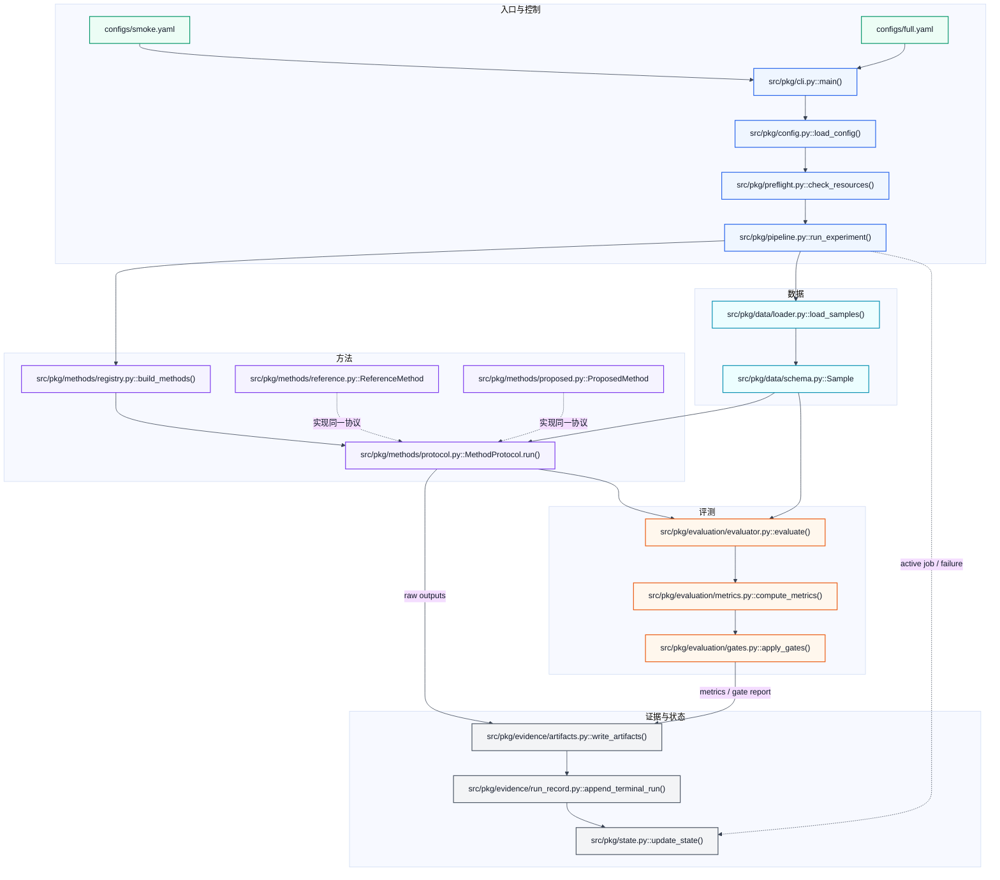

# Mini Experiment 工程架构

这张图从配置入口一直画到运行账本，节点精确到推荐的 Python 文件和主要符号。实际项目
若沿用外部框架，应把 `src/pkg/...` 替换成框架里的真实路径。

```mermaid
%%{init: {"theme":"base","themeVariables":{"background":"#FFFFFF","primaryTextColor":"#111827","lineColor":"#374151","fontFamily":"Arial, sans-serif"}}}%%
flowchart TB
    subgraph entry["入口与控制"]
        direction LR
        smoke["configs/smoke.yaml"]
        full["configs/full.yaml"]
        cli["src/pkg/cli.py::main()"]
        config["src/pkg/config.py::load_config()"]
        preflight["src/pkg/preflight.py::check_resources()"]
        pipeline["src/pkg/pipeline.py::run_experiment()"]
        smoke --> cli
        full --> cli
        cli --> config
        config --> preflight
        preflight --> pipeline
    end

    subgraph data_layer["数据"]
        direction LR
        loader["src/pkg/data/loader.py::load_samples()"]
        schema["src/pkg/data/schema.py::Sample"]
        loader --> schema
    end

    subgraph method_layer["方法"]
        direction LR
        registry["src/pkg/methods/registry.py::build_methods()"]
        protocol["src/pkg/methods/protocol.py::MethodProtocol.run()"]
        reference["src/pkg/methods/reference.py::ReferenceMethod"]
        proposed["src/pkg/methods/proposed.py::ProposedMethod"]
        registry --> protocol
        reference -. "实现同一协议" .-> protocol
        proposed -. "实现同一协议" .-> protocol
    end

    subgraph evaluation_layer["评测"]
        direction LR
        evaluator["src/pkg/evaluation/evaluator.py::evaluate()"]
        metrics["src/pkg/evaluation/metrics.py::compute_metrics()"]
        gates["src/pkg/evaluation/gates.py::apply_gates()"]
        evaluator --> metrics
        metrics --> gates
    end

    subgraph evidence_layer["证据与状态"]
        direction LR
        writer["src/pkg/evidence/artifacts.py::write_artifacts()"]
        receipt["src/pkg/evidence/run_record.py::append_terminal_run()"]
        state["src/pkg/state.py::update_state()"]
        writer --> receipt
        receipt --> state
    end

    pipeline --> loader
    pipeline --> registry
    schema --> protocol
    protocol --> evaluator
    schema --> evaluator
    protocol -->|raw outputs| writer
    gates -->|metrics / gate report| writer
    pipeline -. "active job / failure" .-> state

    classDef configNode fill:#ECFDF5,stroke:#059669,color:#111827,stroke-width:1.5px;
    classDef controlNode fill:#EFF6FF,stroke:#2563EB,color:#111827,stroke-width:1.5px;
    classDef dataNode fill:#ECFEFF,stroke:#0891B2,color:#111827,stroke-width:1.5px;
    classDef methodNode fill:#F5F3FF,stroke:#7C3AED,color:#111827,stroke-width:1.5px;
    classDef evalNode fill:#FFF7ED,stroke:#EA580C,color:#111827,stroke-width:1.5px;
    classDef evidenceNode fill:#F3F4F6,stroke:#4B5563,color:#111827,stroke-width:1.5px;
    class smoke,full configNode;
    class cli,config,preflight,pipeline controlNode;
    class loader,schema dataNode;
    class registry,protocol,reference,proposed methodNode;
    class evaluator,metrics,gates evalNode;
    class writer,receipt,state evidenceNode;
```
